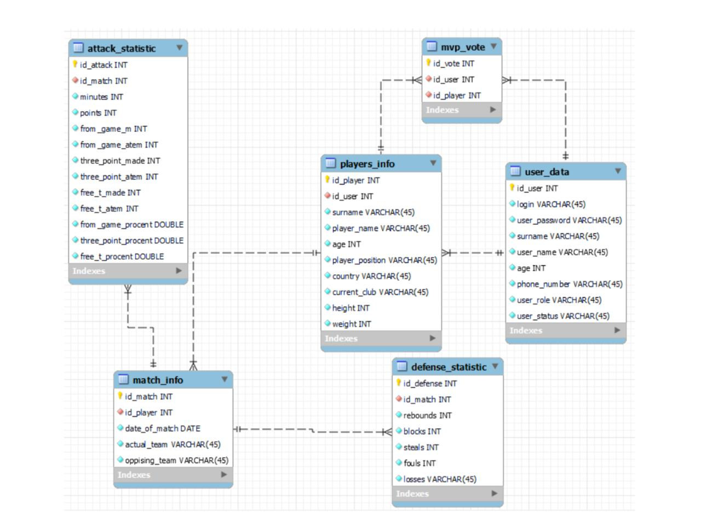

# We Are Playing Basketball

## Approximate expected ERD

    

## Approximate expected API

### Authentication

| HTTP Method | URL          | Description                   | Required Role |
|-------------|--------------|-------------------------------|---------------|
| POST        | /auth/login  | User login, issues a token    | Any           |
| POST        | /auth/logout | Logout, invalidates the token | Any           |

### Users

| HTTP Method | URL         | Description         | Required Role |
|-------------|-------------|---------------------|---------------|
| GET         | /users      | Get list of users   | ADMIN         |
| GET         | /users/{id} | Get user info by ID | ADMIN         |
| POST        | /users      | Create a user       | ADMIN         |
| PUT         | /users/{id} | Update a user       | ADMIN         |
| DELETE      | /users/{id} | Delete a user       | ADMIN         |

### Players

| HTTP Method | URL           | Description         | Required Role |
|-------------|---------------|---------------------|---------------|
| GET         | /players      | Get list of players | Any           |
| GET         | /players/{id} | Get player info     | Any           |
| POST        | /players      | Add a player        | ADMIN         |
| PUT         | /players/{id} | Update player data  | ADMIN         |
| DELETE      | /players/{id} | Delete a player     | ADMIN         |

### Teams

| HTTP Method | URL         | Description   | Required Role |
|-------------|-------------|---------------|---------------|
| GET         | /teams      | List of teams | Any           |
| GET         | /teams/{id} | Team info     | Any           |
| POST        | /teams      | Add a team    | ADMIN         |
| PUT         | /teams/{id} | Update a team | ADMIN         |
| DELETE      | /teams/{id} | Delete a team | ADMIN         |

### Seasons

| HTTP Method | URL           | Description     | Required Role |
|-------------|---------------|-----------------|---------------|
| GET         | /seasons      | List of seasons | Any           |
| GET         | /seasons/{id} | Season info     | Any           |
| POST        | /seasons      | Add a season    | ADMIN         |
| PUT         | /seasons/{id} | Update a season | ADMIN         |
| DELETE      | /seasons/{id} | Delete a season | ADMIN         |

### Matches

| HTTP Method | URL           | Description                 | Required Role |
|-------------|---------------|-----------------------------|---------------|
| GET         | /matches      | List of all matches         | Any           |
| GET         | /matches/{id} | Info about a specific match | Any           |
| POST        | /matches      | Create a match              | ADMIN         |
| PUT         | /matches/{id} | Update a match              | ADMIN         |
| DELETE      | /matches/{id} | Delete a match              | ADMIN         |

### Stats

| HTTP Method | URL                           | Description              | Required Role |
|-------------|-------------------------------|--------------------------|---------------|
| GET         | /matches/{matchId}/statistics | Player stats for a match | Any           |
| GET         | /statistics/{id}              | Get stats by ID          | Any           |
| POST        | /matches/{matchId}/statistics | Add/update player stats  | ADMIN         |
| DELETE      | /statistics/{id}              | Delete a stats record    | ADMIN         |

### Stats by team / player / match

| HTTP Method | URL                              | Description                                                                  | Required Role |
|-------------|----------------------------------|------------------------------------------------------------------------------|---------------|
| GET         | /stats/players/top-scorers       | Get list of players with the highest number of points in a season / all time | Any           |
| GET         | /stats/players/top-assisters     | Get list of players with the highest number of assists                       | Any           |
| GET         | /stats/players/top-rebounders    | Get list of top rebounders                                                   | Any           |
| GET         | /stats/players/top-stealers      | Get list of players with the highest number of steals                        | Any           |
| GET         | /stats/players/top-blockers      | Get list of top shot blockers                                                | Any           |
| GET         | /stats/players/efficiency-rating | Get player efficiency rating (based on aggregate stats)                      | Any           |
| GET         | /stats/players/minutes-played    | Get list of players by total minutes played                                  | Any           |
| GET         | /stats/teams/average-points      | Get average number of points scored by teams per match                       | Any           |
| GET         | /stats/teams/win-rate            | Get win percentage by teams                                                  | Any           |
| GET         | /stats/matches/highest-scoring   | Get list of matches with the highest total points scored                     | Any           |

## Contributing

We welcome contributions from the community. Feel free to drop an ISSUE or branch out and drop a PR.

## License

This project is licensed under the MIT License. See the [LICENSE](../LICENSE) file for details.

## Contact

If you have any questions or feedback, please feel free to contact us or create an issue
in [Issues](https://github.com/davedandevs/basketball/issues/new/choose).
